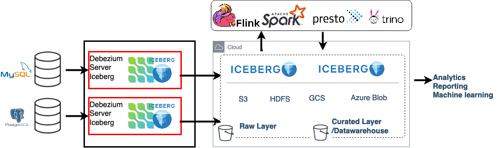

Today it is best practise to build data lake for Analytics

Data Lake: A data lake is usually a central store of data including raw copies of source system data, sensor data, social data etc. You can store your data as-is, without having to first structure/process the data, and run different types of analytics.

Are you looking for a simple way to build Data lake? Do you need to load it with realtime data pipeline from your source databases, supporting ACID transactions and SQL updates?
Now is possible with "*Debezium Server Iceberg*" project, without any dependency to Apache Kafka or Apache Spark applications to create data pipeline.

+++<!-- more -->+++

==== Debezium

https://debezium.io[Debezium] is an open source distributed platform for change data capture.
Debezium extracts change events in different formats such as json, avro, protobuf and delivers to event streaming platforms.
Most of the time, Debezium is used with Apache Kafka and Kafka Connect, specifically. But via Debezium Server, also users of other messaging infrastructure like Kinesis, Google Pub/Sub, Pulsar can benefit from Debezium's change data capture capabilities. Here you can see
https://debezium.io/documentation/reference/operations/debezium-server.html#_sink_configuration[list of supported destinations].

==== Apache Iceberg

https://iceberg.apache.org/[Apache Iceberg] is an open table format for huge analytic datasets.
Iceberg adds tables to compute engines including Spark, Trino, PrestoDB, Flink and Hive using a high-performance table format that works just like a SQL table.
It supports ACID Inserts as well as Row level Deletes/Updates. It provides java API to manage table metadata, like schema, partition spec, metadata, and data files that store table data.

== Debezium Server Iceberg
Iceberg Consumer connects two projects and enables the features both projects providing. For example: With the consumer it's possible to process realtime CDC data from a source database and upload them to any object storage supported by Iceberg.

Debezium Server provides SPI to https://debezium.io/documentation/reference/operations/debezium-server.html#_implementation_of_a_new_sink[implement new sink adapters] and this is what's being used by **Debezium Server Iceberg** to build Debezium/Iceberg consumer.

Iceberg consumer converts CDC events to Iceberg data files and commits them to destination iceberg table using iceberg Java API.

Consumer maps each source table to a destination Iceberg table. When destination iceberg table is not there consumer will try to create it using the event schema and key schema. Additionally, event schema used to map change event to Iceberg record, to do correct data type conversion. Because of this requirement `debezium.format.value.schemas.enable` should be set to `true`.

on high level change events processed like below ::
For each received batch of events
* events are grouped per destination Iceberg table.
*** since each source table mapped to a destination Iceberg table by the consumer. Each group contains list of change events coming from a single source table. And each group has a same data structure/schema.
* for each destination, events converted to Iceberg records.
* after events converted to Iceberg record, they are saved as iceberg data and delete files.
*** delete files are created only if the consumer is running with upsert mode.
*** For both file types parquet format used. Apache Parquet is designed for efficient as well as performant flat columnar storage format of data compared to row based files like CSV or TSV files.
* as a last step, these files are committed to the destination Iceberg table(i.e. uploaded to the destination storage).
* uploaded change events marked as processed by Debezium.

Here is a complete example configuration for using Debezium Server with the Iceberg adaptor:
[source,properties]
----
debezium.sink.type=iceberg
# run with append mode
debezium.sink.iceberg.upsert=false
debezium.sink.iceberg.upsert-keep-deletes=true
debezium.sink.iceberg.table-prefix=debeziumcdc_
debezium.sink.iceberg.table-namespace=debeziumevents
debezium.sink.iceberg.fs.defaultFS=s3a://S3_BUCKET);
debezium.sink.iceberg.warehouse=s3a://S3_BUCKET/iceberg_warehouse
debezium.sink.iceberg.type=hadoop
debezium.sink.iceberg.catalog-name=mycatalog
debezium.sink.iceberg.catalog-impl=org.apache.iceberg.hadoop.HadoopCatalog
# enable event schemas
debezium.format.value.schemas.enable=true
debezium.format.value=json
# complex nested data types are not supported, do event flattening. unwrap message!
debezium.transforms=unwrap
debezium.transforms.unwrap.type=io.debezium.transforms.ExtractNewRecordState
debezium.transforms.unwrap.add.fields=op,table,source.ts_ms,db
debezium.transforms.unwrap.delete.handling.mode=rewrite
debezium.transforms.unwrap.drop.tombstones=true
----

=== Upsert and Append Modes

By default, Iceberg Consumer is running with upsert mode `debezium.sink.iceberg.upsert=true`. When a row updated on source table destination row replaced with the new updated version. And when a row deleted from source its deleted from destination. With upsert mode data at destination kept identical to source data. Update mode uses Iceberg equality delete feature and creates delete files using key of the debezium event(PK of the source table). To avoid duplicate data deduplication is done on each batch and only last version of the record kept. For example in single batch of events same record could appear twice once its inserted and once its updated. With Update mode always last extracted version of the record used.

Note:: When a source table don't have record key(PK) consumer uses `append` mode for the table. <<Append mode>> explained below.

==== Upsert Mode Keeping Deleted Records

For some use cases it's useful to keep deleted records as soft delete. This is possible by setting `debezium.sink.iceberg.upsert-keep-deletes` to `true`.
This setting will keep the latest version of deleted records (`__op=d`) in the destination Iceberg table. Setting it to false will remove deleted records from the destination table.

==== Append mode

This is most straightforward operation mode, setting `debezium.sink.iceberg.upsert` to `false` sets the operation mode to append.
With append mode all received records are appended to destination table. No data deduplication or deletion done.  With append mode it's possible to analyze entire change history of a record.

=== Optimizing batch size (commit interval)

Debezium extracts and delivers database events in real time and this could cause too frequent commits( generate too many small files) to Iceberg table.
This is not optimal for batch processing especially when near realtime data feed is sufficient.
To avoid this problem it's possible to use following configuration and increase batch size per commit.

**MaxBatchSizeWait**: uses Debezium metrics to optimize batch size, it periodically reads streaming queue current size and waits until it reaches to `max.batch.size`.
Maximum wait and check intervals are controlled by `debezium.sink.batch.batch-size-wait.max-wait-ms`, `debezium.sink.batch.batch-size-wait.wait-interval-ms` properties.
During the wait debezium events are collected in memory (in debezium streaming queue). This way each commit(set of events processed) gets more records and consistent batch size. This setting should be configured together with `debezium.source.max.queue.size` and `debezium.source.max.batch.size` debezium properties

Note:: It's also possible consume realtime events and do https://iceberg.apache.org/maintenance/[data compaction] afterwards with separate compaction job. Iceberg supports compacting data and metadata files to increase performance.

example setting::
[source,properties]
----
debezium.sink.batch.batch-size-wait=MaxBatchSizeWait
debezium.sink.batch.metrics.snapshot-mbean=debezium.postgres:type=connector-metrics,context=snapshot,server=testc
debezium.sink.batch.metrics.streaming-mbean=debezium.postgres:type=connector-metrics,context=streaming,server=testc
# increase max.batch.size to receive large number of events per batch
debezium.source.max.batch.size=50000
debezium.source.max.queue.size=400000
debezium.sink.batch.batch-size-wait.max-wait-ms=60000
debezium.sink.batch.batch-size-wait.wait-interval-ms=10000
----

== Loading Next Data Lake Layers

Now raw layer of the data lake loaded, including data deduplication and near realtime pipeline features. As a next step it is straightforward to build curated layer(sometimes it's called Analytic Layer or Datawarehouse) on top of it.

For example someone could easily use https://Iceberg.apache.org/spark-writes/[Spark SQL](or Prestodb, Trino, Flink) and load https://en.wikipedia.org/wiki/Slowly_changing_dimension[slowly changing dimension], most commonly used Datawrahouse table type.
[source,sql]
----
MERGE INTO dwh.consumers t
     USING (
     -- new data to insert
         SELECT customer_id, name, effective_date, to_date('9999-12-31', 'yyyy-MM-dd') as end_date FROM debezium.consumers
         UNION ALL
     -- update exiting records. close end_date
         SELECT t.customer_id, t.name, t.effective_date, s.effective_date as end_date FROM debezium.consumers s
         INNER JOIN dwh.consumers t on s.customer_id = t.customer_id AND t.current = true

     ) s
     ON s.customer_id = t.customer_id AND s.effective_date = t.effective_date
     -- close last records/versions.
     WHEN MATCHED
       THEN UPDATE SET t.current = false, t.end_date = s.end_date
     -- insert new versions and new data
     WHEN NOT MATCHED THEN
        INSERT(customer_id, name, current, effective_date, end_date)
        VALUES(s.customer_id, s.name, true, s.effective_date, s.end_date);
----

Iceberg also supports using https://iceberg.apache.org/spark-writes/[delete, insert, update statements].
[source,sql]
----
INSERT INTO prod.db.table SELECT ...;

DELETE FROM prod.db.table WHERE ts >= '2020-05-01 00:00:00' and ts < '2020-06-01 00:00:00';
DELETE FROM prod.db.orders AS t1 WHERE EXISTS (SELECT order_id FROM prod.db.returned_orders WHERE t1.order_id = order_id;

UPDATE prod.db.all_events
SET session_time = 0, ignored = true
WHERE session_time < (SELECT min(session_time) FROM prod.db.good_events));
----

You could see more examples and experiment with Iceberg and Spark with https://github.com/ismailsimsek/iceberg-examples[this] project.

=== Contribution

This project is new and there are many things to improve, please feel free to test it, give feedback, open feature request or send pull request.

- https://github.com/memiiso/debezium-server-iceberg[Debezium Server Iceberg] Project